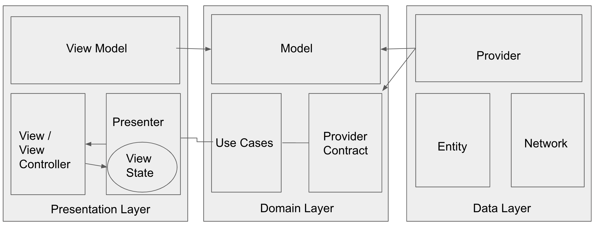

# MarvelCharacters

This app will show all the marvel characters List & their respective details.

We are using XcodeGen framework for the dependencies which can me modified using yml.
List of Dependencies used in project using SPM
* Kingfisher (7.0.0):  For caching and loading the images we have used this framework.
* Moya (15.0.0):  For enhancing network requests

## Architecture:
There are 3 main layers of the architecture. Those are -

- Data Layer
- Domain layer
- Presentation/ Feature layer

### Data Layer: Data layer is responsible to deal with all the service call & entities.
Provider is helping to request network call. Provider contains method with required success & failure.
Entities is there to carry the atributes coming from API response

### Domain Layer: Domain layer contains all the models which are useful to parse data coming from API response.
We have provider contract inside our domain layer which contains all the method of network request.
We have use case class too in domain layer which is responsible to interact provider to request the network call and handle scneios.

### Presentation / Feature layer: This layer contain presenter, viewController & viewModel. It is useful for all UI related operations
ViewState is responsbile to update viewState of View Controller.
Presenter is responsible to make all operations and update the view according to the result with the help of viewState. 

## Unit testing 
 For Unit testing, application uses the native framework which is XCTest framework and testing for all the three layers have been performed with respected mock data is crated.

